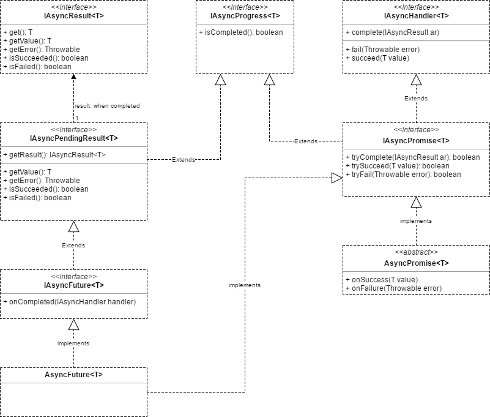

## Single-threaded Asynchronous support library




**IAsyncResult** - represent result of asynchronous operation. Should be **immutable**.


**IAsyncPendingResult** - represent pending result of asynchronous operation that 
may not be completed yet.


**IAsyncFuture** - represent asynchronous operation.
###### example:
```java
IAsyncFuture<String> future = fooAsync()
if(future.isCompleted()){
  // operation was completed asynchronously
  // print result if succeeded, re-throw exception otherwise
  System.out.println(future.get());
} else {
  // operation still in progress, register continuation
  future.onCompleted(ar -> {
    if(ar.isSucceeded()){
      // print result if succeeded
      System.out.println(future.getValue());
    }
  })
}
```

**AsyncFuture** - represents the producer side of a **IAsyncFuture**.
###### example:
```java
IAsyncFuture<String> fooAsync() {
  AsyncFuture<String> future = new AsyncFuture();
  timer(1000, elapsed->future.succeed(elapsed.toString()));
  return future;
}
```

**IAsyncHandler** - represent continuation for asynchronous operation.
###### example:
```java
void fooAsync(IAsyncHandler<String> handler) {
  timer(1000, elapsed->handler.succeed(elapsed.toString()));
}
```

**IAsyncPromise** - represent completion source for asynchronous operation.
###### example:
```java
void onConnected(WebSocket ws, IAsyncPromise<String> promise) {
  if (!promise.trySucceed(ws)) {
    ws.close();
  }
}
```

**AsyncPromise** - wrapper to transform continuation(s) in completion source 
###### example:
```java
AsyncPromise<String> promise = AsyncPromise.from(ar -> {
  if (ar.isSucceeded()) {
    System.out.println(ar.getValue());
  }
});
fooAsync(promise);
timer(1000, elapsed->promise.failed("operation timed out"));
```

IAsyncProgress - represents the status of an asynchronous operation.