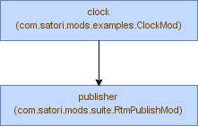

<!-- generated, do not modify -->
## 'clock' example


##### build app
```
gradle installDist
```

##### run app using gradle
```
gradle run
```

##### run app using command line
```
./.out/install/clock/bin/clock
```

##### build docker image
```
gradle buildDockerImage
```

##### run interactive docker container using gradle
```
gradle runDockerContainer
```

##### run interactive docker container using command line
```
docker run --rm -ti mods-examples-clock
```

##### run daemonized docker container
```
docker run --restart=always --log-opt max-size=64m --log-opt max-file=16 -d --name=clock mods-examples-clock
```

