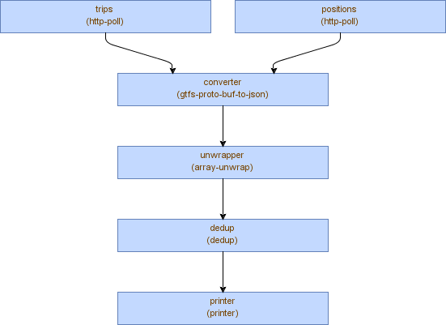

## Satori Composer (preview)

#### Example

```yaml

{
  "stats": {
    "period": 1000, // in ms., 1 sec.
    "console": {
      "period": 10000
    }
  },
  "mods": {
    "poller-vehicle-positions": {
      "type": "com.satori.mods.suite.HttpPollMod",
      "settings": {
        "delay": 1000, // in ms., 1 sec.
        "format": "binary",
        "host": "gtfs.bigbluebus.com",
        "ssl": true,
        "verify-host": false,
        "path": "/vehiclepositions.bin"
      }
    },
    "poller-trip-updates": {
      "type": "com.satori.mods.suite.HttpPollMod",
      "settings": {
        "delay": 1000, // in ms., 1 sec.
        "format": "binary",
        "host": "gtfs.bigbluebus.com",
        "ssl": true,
        "verify-host": false,
        "path": "/tripupdates.bin"
      }
    },
    "converter": {
      "type": "com.satori.mods.suite.GtfsProtoBufToJsonMod",
      "connectors": ["poller-vehicle-positions", "poller-trip-updates"],
      "settings": {
        "user-data": "auckland"
      }
    },
    "dedup-filter": {
      "type": "com.satori.mods.suite.DedupMod",
      "connectors": "converter",
      "settings": {
        "expiration-interval": 600000,
        "override": false,
        "key-selector": "/entity"
      }
    },
    "publisher": {
      "type": "com.satori.mods.suite.RtmPublishMod",
      "connectors": "dedup-filter",
      "settings": {
        "channel": "YOUR_CHANNEL",
        "host": "YOU_HOST", //no wss scheme, just host: x.satori.com
        "ssl": true,
        "args": {"appkey": "YOU_APPKEY"} //,
        // enable if your publish permission needs auth
        //"auth": {"role": "YOUR_ROLE","secret": "YOUR_SECRET"}
      }
    }
  }
}
```

### Documentation
- [Overview](https://www.satori.com/docs/opensource/composer#overview)
- [Examples](https://www.satori.com/docs/opensource/composer#examples)
- [Mods Suite](https://www.satori.com/docs/opensource/composer#mods-suite)
- [Building and Running](https://www.satori.com/docs/opensource/composer#building-and-running)
- [Async support library](docs/async/readme.md)

### Common Libraries
- [Gtfs Library For Real-Time](https://github.com/satori-com/satori-composer/tree/dev/libs/gtfs)


### Maven (snapshots)
```xml
<repository>
  <url>https://oss.sonatype.org/content/repositories/snapshots/</url>
</repository>
```
```xml
<dependency>
    <groupId>com.satori</groupId>
    <artifactId>satori-composer</artifactId>
    <version>0.5.2-SNAPSHOT</version>
</dependency>
```


### Download
[Latest release](https://github.com/satori-com/satori-composer/releases/latest)

#### Requirements
java 1.8


